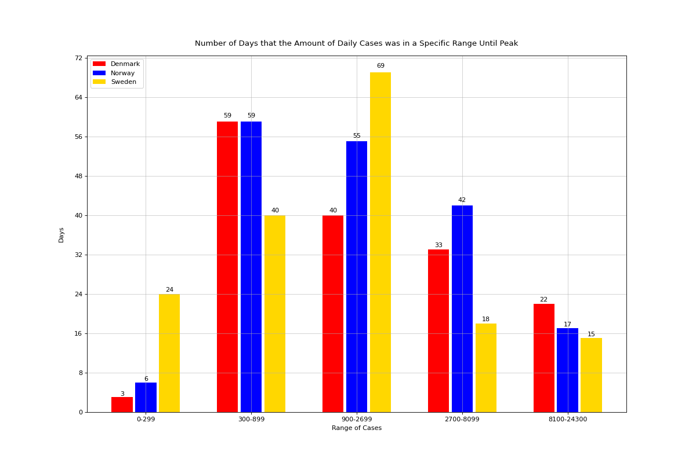

# Covid-19_Project
Personal ETL and data-analysis project on Covid-19

## Introduction
The project includes retrieving data from European Centre for Disease Prevention and Control (EDCD)
for COVID-19 pandemic. The data has been transformed according to the interest and a small-scale
data analysis is performed.

## Libraries
`pandas`, `matplotlib`, `requests`, `numpy`

## Summary of Scripts
The `main.py` includes data pulling from ECDC, filtering the data of interest, and saving the 
new data lists. We have two lists; Europe and Scandinavian data list.

The `data_analysis.py` performs small-scale data analysis.

The rest of the .py files draw figures for this data analysis.

The figures can be found in the figures directory.

## Objective
The main objective of this project is to learn the ETL process.

The second objective is to perform data analysis on COVID-19 pandemic data.

I am a beginner, I got a great deal of help from the internet, please feel free to reach me if
you have questions and comments!

## Results

The following figures were obtained at the time this code was run. 

### The European Data

The reported number of cases and the difference in count in each day can be seen as follows.

The reported number of death counts and the difference in count in each day can be seen as follows.

### Scandinavian Data

Here, figures are drawn focusing on Norway, Denmark, and Sweden.
The reported number of cases and the difference in count in each day can be seen as follows. The graph
shows all 3 countries in total.

The reported number of death counts and the difference in count in each day can be seen as follows. The graph
shows all 3 countries in total.

The daily death amount differences in each Scandinavian country can be seen here:

I have considered a wave that started 2021-08-01 and reached it peak 2022-01-27.
The figure shows the number of days each country had a number of cases in a specific range until the wave peaked.
The range is shown as an exponential growth and shown by using a column graph in the following:

## Copyright
The data used here is retrieved from European Centre for Disease Prevention and Control:
https://www.ecdc.europa.eu/en . ECDC is acknowledged as the original source of the material.

This project is licensed under the terms of the MIT license.

